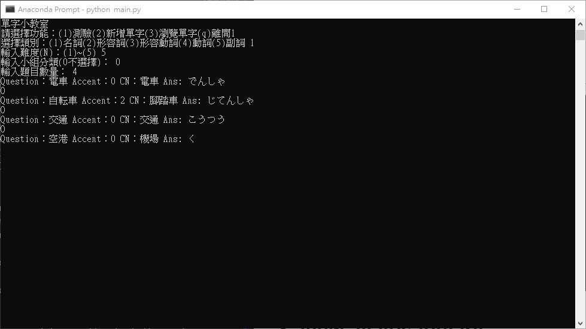
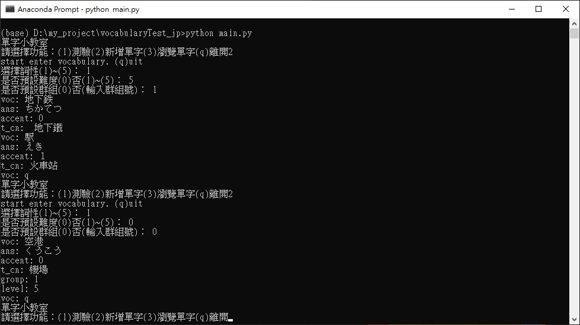
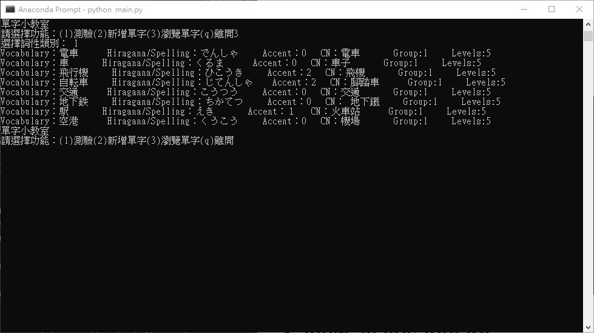

little_vocabulary_tester
===

## Introdution
---
This is a little vocabulary tester in command line style for testing myself about vocabulary while I am learning Japanese. Currently, it's for Japanese and including five categories(**Noun, Adjective, Adjectival Noun, Verb and Adjectival Verb**) of vocabulary.

So far, there are three functions you can do in below list.

1. Start a test
2. Add new words
3. View all vocabulary

This project saves vocabulary as local file *voc_data.json*, if there is any need to modify vocabulary except add new word, unfortunately, you have to modify directly.

## How to use
---
When you execute this program, there is a main menu and currently 3 function to use by input 1\~3 for function 1\~3.

## Function introdution
---
### 1. Start a test
Test funciton allows you to choose vocabulary from dataset to test by input numbers as parameters to setting up test.
In setting up stage, there are few parameters to set in following order.
1. vocabulary category (noun, adj, adjn, verb, adverb)
2. difficulty (N5~N1)
3. group (you can set whatever number you want to group similar vocabulary)
4. number of questions

***note:***
- In first parameter, 1 for noun, 2 for adj ... 5 for adverb.
- In second parameter, 1 for N1(highest level) ... 5 for N5(lowest level)
- First three parameters take 0 number as meaning of "any".

#### Example

## 2. Add a new word
To add a new word to dataset is easy. There are only few things to fill in which are [voc], [ans], [accent], [t_cn], [group] and [level].
- [voc] is the vocabulary you want to add and will be show when testing.
- [ans] is the answer to verify your input when testing.
- [accent] is to describe how to pronounce. In Japanese, each word has 1 of 4 types(頭高型、平板型、中高型、尾高型) to pronounce and the number given to means where are high pitch and others are low pitch.
- [t_cn] is translation of chinese.
- [group] is to group similar words.
- [level] difficulty of this vocabulary. In range of  1\~5 for N1\~N5.

When adding new word, command line will ask whether sets same group and level to following words. Input 0 to both means you have to manually input [group] and [level] by yourself until leave this function.

#### Example

## 3. View all vocabulary
Simply show all the vocabulary in command line by the category inputed.
#### Example
